<div align="center">
  <h1>🧠 Spatio-Temporal Graph Neural Network for Motor Movement Classification Using 64-Channel EEG Signals</h1>
  <p><strong>PhysioNet EEG Motor Movement/Imagery Database (EEGMMIDB)</strong></p>

  
  
  
</div>

<br />

## 👥 Project Team
| Role | Name | ID |
| :--- | :--- | :--- |
| **Author** | Asfar Hossain SItab | `2026-2-74-008` |
| **Author** | Parmita Hossain Simia | `2026-2-74-009` |
| **Supervisor** | Raihan Ul Islam | *Associate Professor, Dept. of CSE, East West University (EWU)* |

---

## 📌 Track Information
- **Group:** 01
- **Dataset:** PhysioNet EEG MMI
- **Track:** Machine Learning

---

## 🚀 TASK-1: Exploratory Data Analysis (EDA)

### 📊 EDA Summary
The initial phase focuses on deeply exploring the **PhysioNet EEG Motor Movement/Imagery Database (EEGMMIDB)**. 
- **Scale:** 109 subjects with 64 EEG channels sampled at 160 Hz.
- **Scope:** Analyzes motor execution runs (left/right fist) alongside motor imagery runs to identify signal patterns.
- **Techniques:** Signal filtering, epoching, and robust visualizations to lay the groundwork for our downstream machine learning classification tasks.

### 🖼️ Visual Insights (Task 1)
Here are some of the key visual findings extracted from our EDA notebook. These visualizations help us understand the spatial and temporal distributions of the EEG signals.

<details open>
<summary><b>View Visualizations</b></summary>
<br>

| **Topographic Brain Mapping** | **Channel Activity Analysis** |
| :---: | :---: |
| 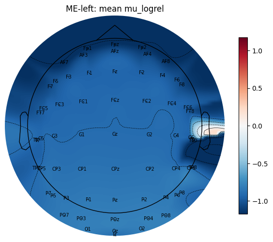 |  |

| **Signal Distributions** | **Temporal Features** |
| :---: | :---: |
|  | 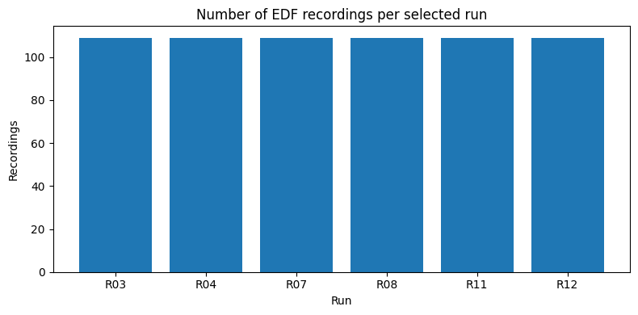 |

| **Frequency Domains** | **Spectral Density** |
| :---: | :---: |
| 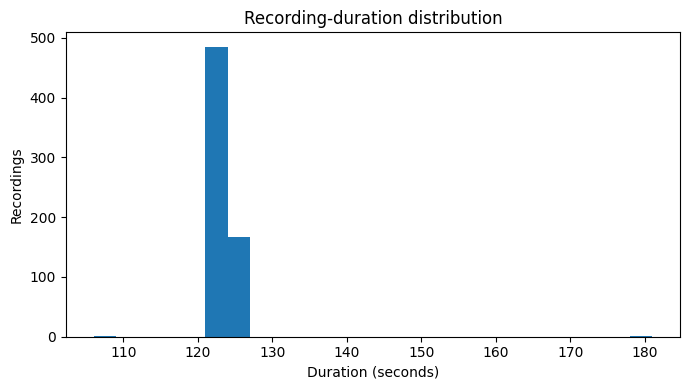 |  |

</details>

---

## 🚀 TASK-2: Motor Movement Classification

### 🧠 Classification Summary
Building upon the insights from our EDA, Task 2 focuses on constructing robust machine learning models to classify motor movements using the EEG signals. We explore both baseline deep learning approaches (1D CNN) and advanced Spatio-Temporal Graph Neural Networks (ST-GNN) to capture the complex spatial correlations and temporal dynamics inherent in EEG data.

### 🖼️ Model & Performance Visual Insights (Task 2)
These visualizations illustrate the data processing, model architectures, and training evaluation results for our classification models.

<details open>
<summary><b>View Visualizations</b></summary>
<br>

| **ERD/ERS Topomaps** | **Class Distribution** |
| :---: | :---: |
| 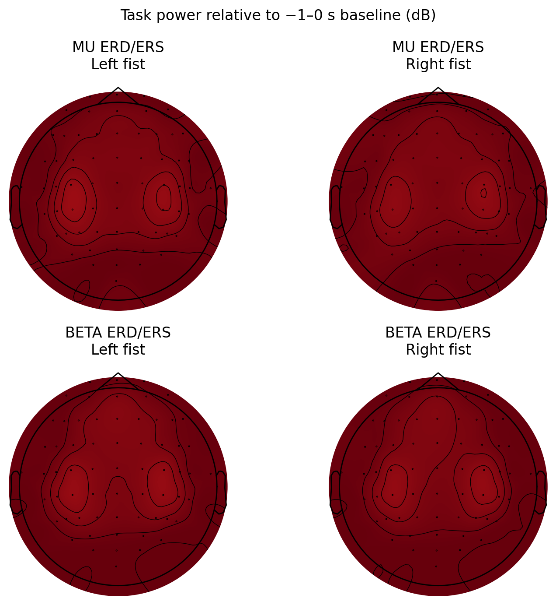 | 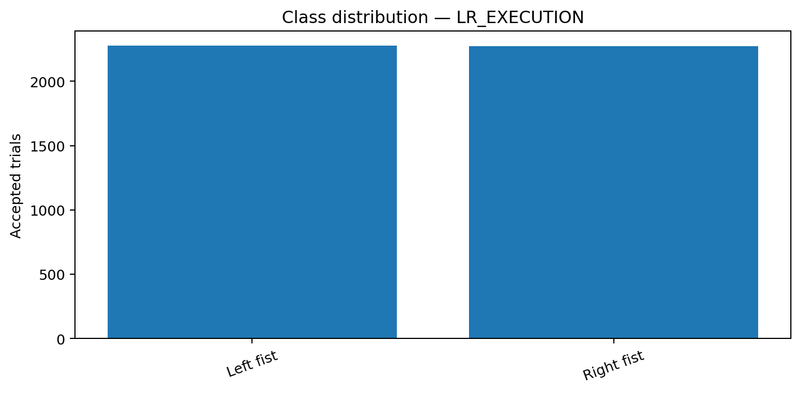 |

| **Brain Graph** | **Normalized Adjacency** |
| :---: | :---: |
| 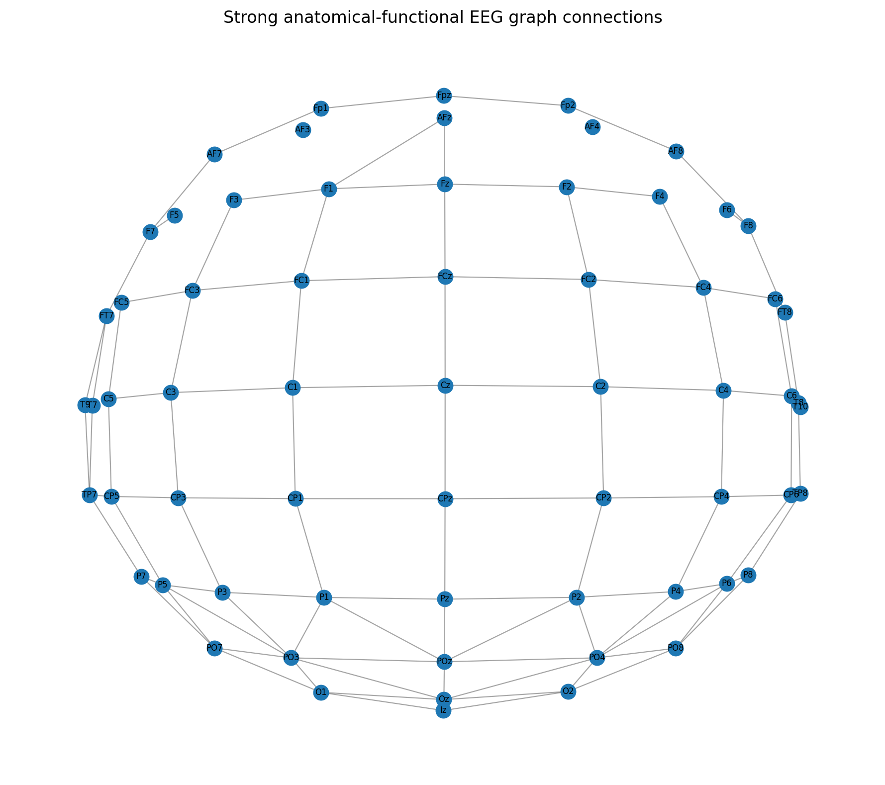 | 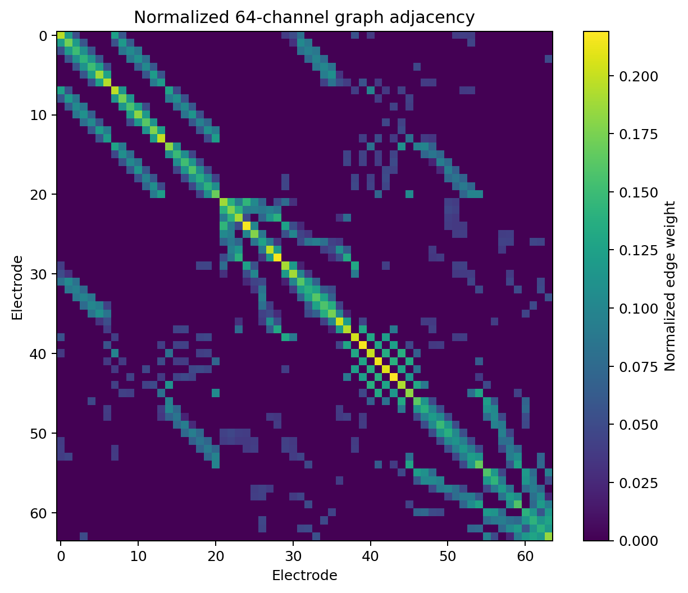 |

| **ST-GNN Architecture Diagram** | **Hybrid ST-GNN Test Confusion Matrix** |
| :---: | :---: |
| 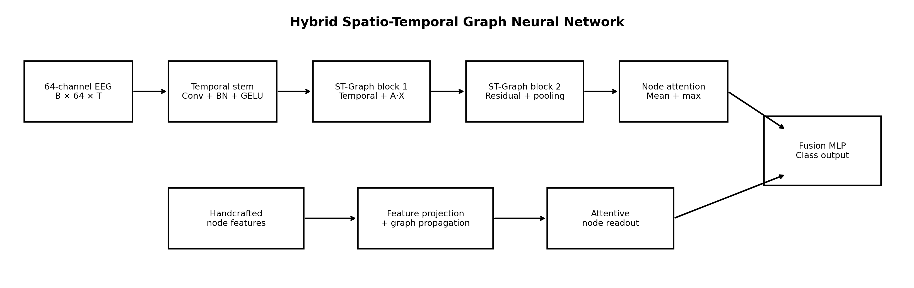 | 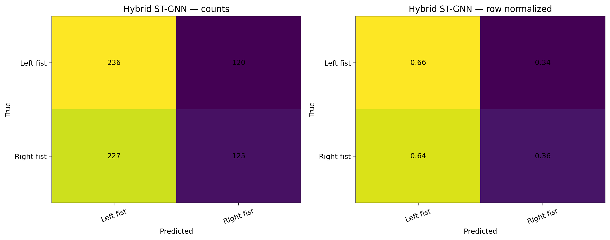 |

| **1D CNN Learning Curve** | **Hybrid ST-GNN Learning Curve** |
| :---: | :---: |
| 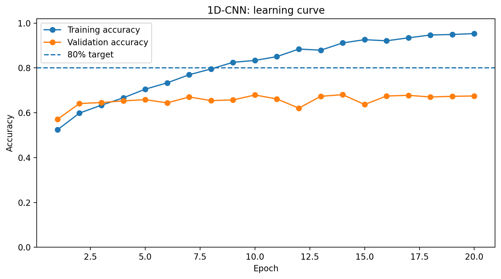 | 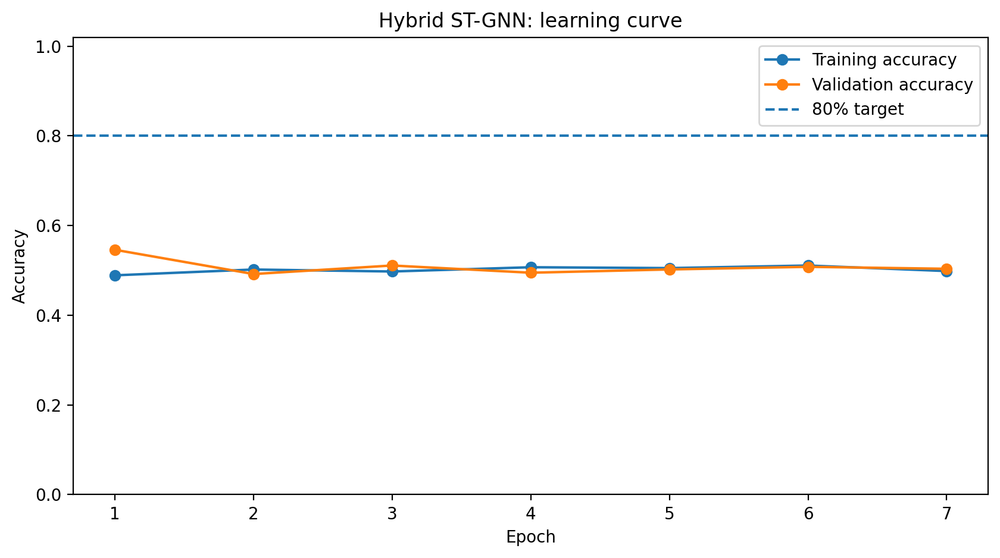 |

</details>

> ⚠️ *Note: **TASK-3** and **TASK-4** methodologies and results will be uploaded in subsequent updates.*

---

## 💻 How to Run
All execution scripts, models, and notebooks are located in the `code/`, `models/`, and `report/` directories. Navigate to specific task folders to reproduce our findings.

```bash
# Example for running EDA (Task 1)
jupyter notebook code/task1/Group01_PhysioNet_EEG_MMI_task1_eda.ipynb
```

---

## 📈 Results
* Our Hybrid ST-GNN effectively classifies motor tasks by capturing both spatial dependencies (via GCNs) and temporal features (via CNNs/LSTMs).
* See the confusion matrix and learning curves in the visualizations section for specific performance metrics.

<div align="center">

### Model Performance Metrics

<table>
  <thead>
    <tr>
      <th align="center">Model</th>
      <th align="center">Test Accuracy</th>
      <th align="center">Precision (Macro)</th>
      <th align="center">Recall (Macro)</th>
      <th align="center">F1-Score (Macro)</th>
    </tr>
  </thead>
  <tbody>
    <tr>
      <td align="center"><b>1D-CNN</b></td>
      <td align="center">65.96%</td>
      <td align="center">0.6596</td>
      <td align="center">0.6596</td>
      <td align="center">0.6596</td>
    </tr>
    <tr>
      <td align="center"><b>XGBoost</b></td>
      <td align="center">64.27%</td>
      <td align="center">0.6426</td>
      <td align="center">0.6426</td>
      <td align="center">0.6426</td>
    </tr>
    <tr>
      <td align="center"><b>Random Forest</b></td>
      <td align="center">64.27%</td>
      <td align="center">0.6429</td>
      <td align="center">0.6425</td>
      <td align="center">0.6423</td>
    </tr>
    <tr>
      <td align="center"><b>Motor-area CSP-LDA</b></td>
      <td align="center">64.12%</td>
      <td align="center">0.6412</td>
      <td align="center">0.6412</td>
      <td align="center">0.6412</td>
    </tr>
    <tr>
      <td align="center"><b>Extra Trees</b></td>
      <td align="center">63.84%</td>
      <td align="center">0.6393</td>
      <td align="center">0.6382</td>
      <td align="center">0.6376</td>
    </tr>
    <tr>
      <td align="center"><b>Gradient Boosting</b></td>
      <td align="center">63.56%</td>
      <td align="center">0.6361</td>
      <td align="center">0.6354</td>
      <td align="center">0.6350</td>
    </tr>
    <tr>
      <td align="center"><b>Logistic Regression</b></td>
      <td align="center">61.86%</td>
      <td align="center">0.6186</td>
      <td align="center">0.6186</td>
      <td align="center">0.6186</td>
    </tr>
    <tr>
      <td align="center"><b>MLP</b></td>
      <td align="center">61.72%</td>
      <td align="center">0.6174</td>
      <td align="center">0.6171</td>
      <td align="center">0.6170</td>
    </tr>
    <tr>
      <td align="center"><b>RBF SVM</b></td>
      <td align="center">61.16%</td>
      <td align="center">0.6116</td>
      <td align="center">0.6116</td>
      <td align="center">0.6116</td>
    </tr>
    <tr>
      <td align="center"><b>Decision Tree</b></td>
      <td align="center">57.77%</td>
      <td align="center">0.5780</td>
      <td align="center">0.5774</td>
      <td align="center">0.5768</td>
    </tr>
    <tr>
      <td align="center"><b>k-NN</b></td>
      <td align="center">57.20%</td>
      <td align="center">0.5738</td>
      <td align="center">0.5724</td>
      <td align="center">0.5701</td>
    </tr>
    <tr>
      <td align="center"><b>Hybrid ST-GNN</b></td>
      <td align="center">50.99%</td>
      <td align="center">0.5100</td>
      <td align="center">0.5090</td>
      <td align="center">0.4975</td>
    </tr>
  </tbody>
</table>

</div>
