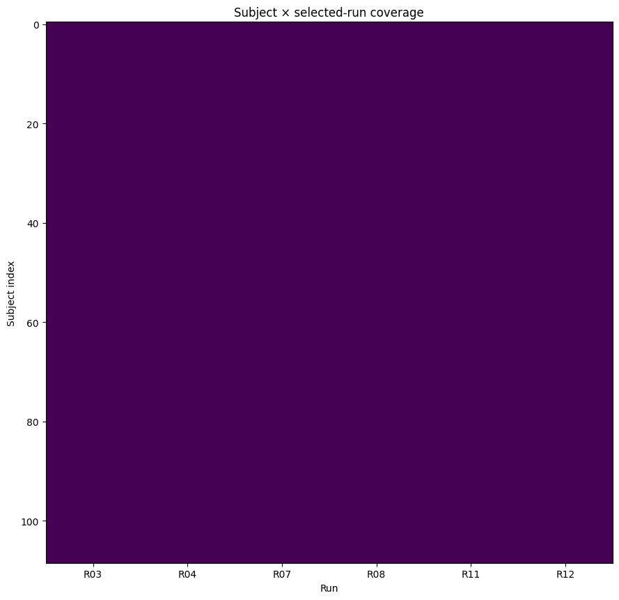
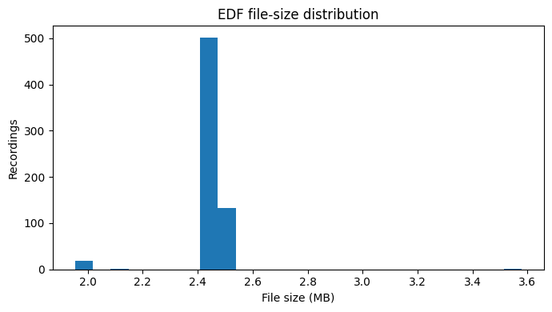

<div align="center">
  <h1>🧠 Spatio-Temporal Graph Neural Network for Motor Movement Classification Using 64-Channel EEG Signals</h1>
  <p><strong>PhysioNet EEG Motor Movement/Imagery Database (EEGMMIDB)</strong></p>

  
  
  
</div>

<br />

## 👥 Project Team
| Role | Name | ID |
| :--- | :--- | :--- |
| **Author** | Asfar Hossain SItab | `2026-2-74-008` |
| **Author** | Parmita Hossain Simia | `2026-2-74-009` |
| **Supervisor** | Raihan Ul Islam | *Associate Professor, Dept. of CSE, East West University (EWU)* |

---

## 📌 Track Information
- **Group:** 01
- **Dataset:** PhysioNet EEG MMI
- **Track:** Machine Learning

---

## 🚀 TASK-1: Exploratory Data Analysis (EDA)

### 📊 EDA Summary
The initial phase focuses on deeply exploring the **PhysioNet EEG Motor Movement/Imagery Database (EEGMMIDB)**. 
- **Scale:** 109 subjects with 64 EEG channels sampled at 160 Hz.
- **Scope:** Analyzes motor execution runs (left/right fist) alongside motor imagery runs to identify signal patterns.
- **Techniques:** Signal filtering, epoching, and robust visualizations to lay the groundwork for our downstream machine learning classification tasks.

### 🖼️ Visual Insights
Here are some of the key visual findings extracted from our EDA notebook. These visualizations help us understand the spatial and temporal distributions of the EEG signals.

<details open>
<summary><b>View Visualizations</b></summary>
<br>

| **Topographic Brain Mapping** | **Channel Activity Analysis** |
| :---: | :---: |
|  |  |

| **Signal Distributions** | **Temporal Features** |
| :---: | :---: |
|  |  |

| **Frequency Domains** | **Spectral Density** |
| :---: | :---: |
|  |  |

</details>

> ⚠️ *Note: **TASK-2** and **TASK-3** methodologies and results will be uploaded in subsequent updates.*

---

## 💻 How to Run
All execution scripts and notebooks are located in the `code/` directory. Navigate to specific task folders to reproduce our findings.

```bash
# Example for running EDA
jupyter notebook code/task1/Group01_PhysioNet_EEG_MMI_task1_eda.ipynb
```

---

## 📈 Results
*To Be Determined (TBD)*
